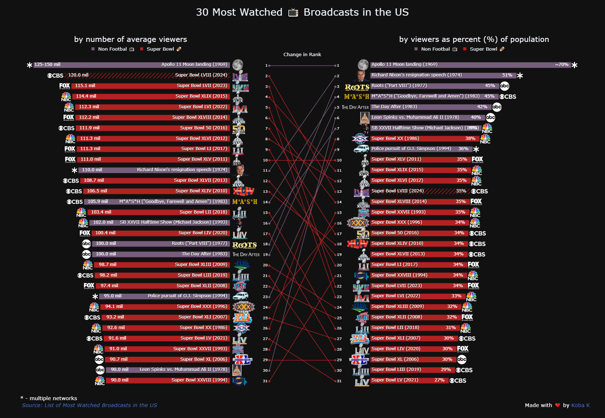
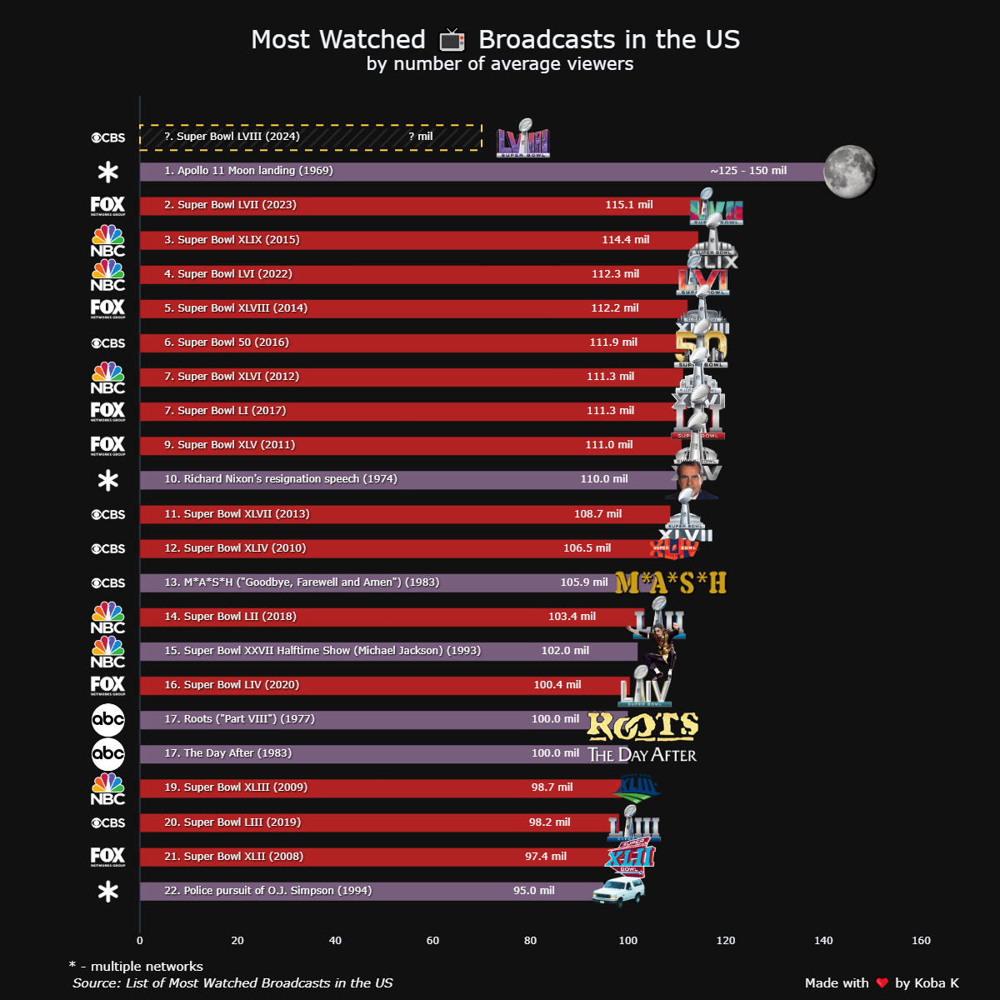

## After Super Bowl LVIII

[HTML Preview](https://kobakhit.com/data-visuals/most-watched-broadcasts/most-watched-broadcasts-us-dark2.html)

## Before Super Bowl LVIII

[HTML Preview](https://htmlpreview.github.io/?https://raw.githubusercontent.com/KobaKhit/vizvault/main/most-watched-broadcasts/most-watched-broadcasts-us-dark.html)

## Summary

Source: [List of Most Watched Broadcasts in the US](https://en.wikipedia.org/wiki/List_of_most_watched_television_broadcasts_in_the_United_States)

Tool: [Plotly in python](https://plotly.com/python/)

Additional Sources:

  - [Super Bowl LVIII Viewing Numbers](https://www.tvtechnology.com/news/super-bowl-lviii-wrap-up-viewing-numbers-up-paramount-stumbles)
  - [iSpot Super Bowl LVIII Report](https://www.ispot.tv/hub/super-bowl-lviii-scores-average-second-by-second-audience-of-126-6-million-viewers-across-all-linear-out-of-home-and-streaming)

Github Repo: [Link](https://github.com/KobaKhit/vizvault/tree/main/most-watched-broadcasts)

**New Additions:**

  - This is a follow up to [my earlier post](https://www.reddit.com/r/dataisbeautiful/comments/1aomos2/oc_most_watched_broadcasts_in_the_us_will). I added the preliminary viewership data for Super Bowl LVIII and a few additional visuals.

  - Based on /u/UX_Strategist feedback added color legend.

  - Based on /u/Deinococcaceae and many others added avg viewers as percent of population metric.

**Updated Notes**:

  - 23 out of 31 most watched programs in the US #TV history are #Superbowl broadcasts🏈.

  - Michael Jackson's Halftime Show was watched by more people than the Superbowl #XXVII itself (102 vs 91 million average viewers). Truly the King of Pop.

  - Creating complex subplots in Plotly becomes really tedious, especially, when trying to align everything. Plotly does not allow using figures as subplots, so I had to use ipywidgets to display graphs side by side.